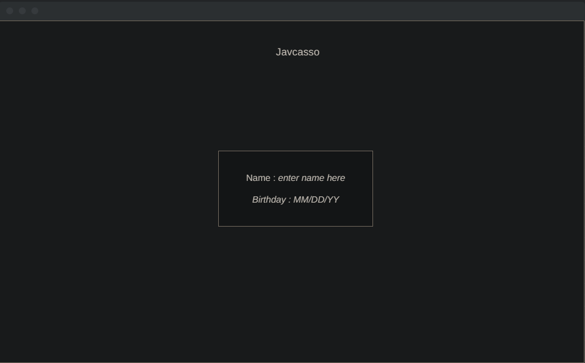
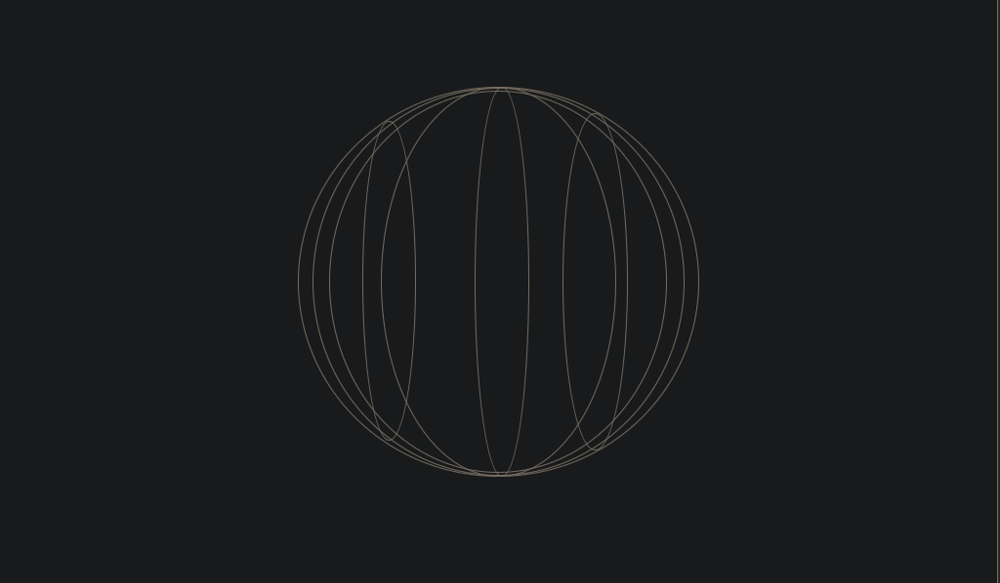

# Javcasso

Javcasso is an app that generates a unique moving art geometric piece of art using a user's name and birthday. By using this data and putting it through an algorithm and connecting it with some maths, a unique piece can be made.

# Wireframe

# Functionality & MVPs

This project will be prompt the user to enter their name and then their birth-date, then simulate a pause for the loading of their artwork. The prompt that covers the whole screen will then be lifted and the art will be shown.

# Technologies, Libraries, APIs

This project will be implemented with:

3JS - to render the sphere

HTML - to hold all the data

CSS - simple styling

Webpack - to bundle and transpile the JS code

npm - to manage project dependencies

JS - functionality for the sphere and transfering input into data that can be used to create sphere

# Implementation

Friday: Spending friday evening researching 3JS.

Saturday: Spend most of the day researching 3JS and installing it into the project

Sunday: Have a sphere rendered on the window

Monday: Make it so that theres a pop up that allows user to input name and birthday, and if there's time implement an algorithm that can be used to change the spheres shape or add attributes to it.

Tuesday: If user input and sphere changes as planned I will spend most of the day trying to make the application prettier.

Wednesday: Look for any potential bugs that can be created by user input.

Thursday: If there's time I would like to add a seperate mode that takes users info but creates an rng sphere based on the chances of being born 1 out of 400 trillion.

# Bonus Features

Can add two modes, one for your current and one for the rng generated based on the chances of user being the user.
