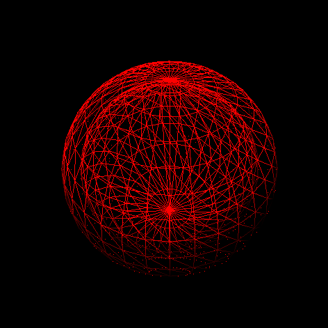

# Javcasso

Javcasso is an app that generates a unique moving art geometric piece of art.

https://finaldessert.github.io/Javcasso2.0/

# Functionality 

Renders 3-D moving Sphere with Particle effects

# Technologies, Libraries, APIs

This project will be implemented with:

3JS - to render the sphere

HTML - to hold all the data

Webpack - to bundle and transpile the JS code

npm - to manage project dependencies

JS - functionality for the sphere

# In the future I may add

A functionality using a user's name and birthday. By using this data and putting it through an algorithm and connecting it with some maths, a unique piece can be made.
